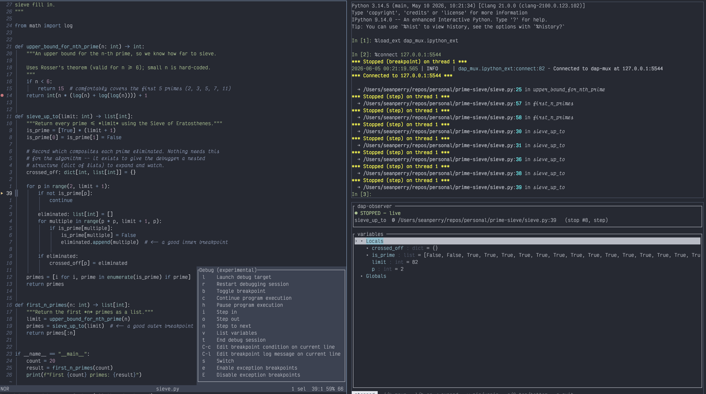

# dap-observer

A read-only, late-joining DAP client that rides a DAP multiplexer session
and renders the current frame's variables in a terminal UI — built so
you can watch variables in a terminal while debugging.

The observer only ever *joins* an existing multiplexer session. It does not spawn the adapter
or manage the session. Start the debugging session however you usually do but wrap it
in a multiplexer.

```sh
# terminal 1 — adapter + mux (see prime-sieve/start_session.sh)
python -m debugpy.adapter --host 127.0.0.1 --port 5678
dap-mux --attach 5678 --headless -p 5679

# terminal 2 — Helix drives the session
hx sieve.py    # set a breakpoint, then :debug-remote 127.0.0.1:5679 launch

# terminal 3 — the observer (this crate)
dap-observer                # connects to 127.0.0.1:5679 by default
dap-observer 5680           # custom port
dap-observer host:port      # custom host + port
```

Step in the editor. The observer refreshes its variable tree whenever execution stops
at a breakpoint.

### Watches

Deeply-nested variables get lost when the tree re-roots on every step. Press
`w` on a variable to **pin** it as a watch: it appears in a `── watched ──`
section pinned to the top of the list and is re-evaluated against the current
frame on every stop, so you don't have to re-navigate to it. Press `w` again on
the variable (or on its watched row) to **unpin** it. A watch that falls out of
scope stays pinned and shows `(unavailable)` until it resolves again.

### Keys

| key | action |
| --- | --- |
| `j` / `k` (or ↓/↑) | move selection |
| `l` / `h` (or →/←) | expand / collapse the selected node (fetches children lazily on expand) |
| `Enter` / `Space` | toggle expand/collapse |
| `w` | pin / unpin the selected variable as a watch |
| `g` / `G` | jump to top / bottom |
| `q` / `Esc` | quit (clean disconnect, terminal restored) |

### Headless mode

`--headless` skips the TUI and prints each stop to stdout. Useful for testing.

```sh
dap-observer --headless
```
